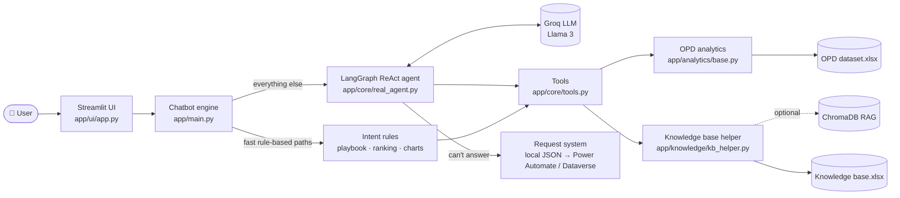

<div align="center">

# 🏥 OPD Analytics Chatbot

**A bilingual (Arabic / English) AI assistant that answers Outpatient Department KPI questions, ranks doctors, compares branches, draws charts, and tells managers who to escalate to — in plain language.**


</div>

---

## 📖 Overview

OPD managers usually dig through large Excel sheets and KPI handbooks to answer questions such as *"Which doctor has the lowest PMS this year?"* or *"What should we do if no-show passes 15%?"*.

This project turns those two sources — an **OPD performance dataset** and a **KPI knowledge base** — into a conversational assistant. Ask a question in Arabic or English and get a data-backed answer, a chart, or a step-by-step investigation playbook.

> The assistant is designed to **never invent numbers**: every figure comes from a tool that queries the real dataset. When it cannot answer, it offers to log a request for the analytics team.

## ✨ Features

| | Feature | Description |
|---|---|---|
| 🌐 | **Bilingual** | Detects the question language and answers in the same language (Arabic ↔ English). |
| 📊 | **KPI analytics** | Revenue vs. target, PMS, COE compliance, no-show, revenue leakage, cases, retention and more. |
| 🏆 | **Doctor & branch ranking** | Best / worst doctors, composite excellence score, multi-branch doctor summaries, branch comparison. |
| 🧭 | **Investigation playbooks** | Knowledge-base driven drivers, root causes, recommended actions and **escalation paths** per KPI threshold. |
| 📈 | **Smart charts** | Natural-language chart requests rendered with Plotly (rankings, trends, comparisons). |
| 🤖 | **Tool-using agent** | A LangGraph ReAct agent picks from ~20 specialised tools, with a safe `flexible_data_query` fallback. |
| 🧠 | **Conversation memory** | Understands follow-up questions such as "and for 2024?". |
| 🔎 | **Optional RAG** | Semantic search over the knowledge base with ChromaDB + multilingual embeddings. |
| 📨 | **Unanswered-request capture** | Questions the bot can't answer are logged locally and can sync to Power Automate / Dataverse. |
| 🎭 | **Role-aware suggestions** | Suggested questions adapt to the user's role, branch and year. |

## 🏗️ Architecture



## 📁 Project structure

```text
OPD-Chatbot/
├── streamlit_app.py          # Root entrypoint (Streamlit / Hugging Face Spaces)
├── requirements.txt
├── .env.example              # Copy to .env and add your keys
├── data/                     # Your private Excel files go here (git-ignored)
└── app/
    ├── config.py             # Paths, thresholds, KPI aliases, branch labels, roles
    ├── main.py               # Chatbot engine: intent rules, playbooks, rankings, charts
    ├── prompts.py            # System prompts
    ├── ui/
    │   ├── app.py            # Streamlit chat interface
    │   └── charts.py         # Plotly chart builders
    ├── core/
    │   ├── real_agent.py     # LangGraph ReAct agent (Groq)
    │   ├── tools.py          # Analytics, KB and chart tools exposed to the agent
    │   ├── llm_client.py     # Groq client with retry and error handling
    │   ├── rag_engine.py     # Optional semantic search (ChromaDB)
    │   ├── memory.py         # Conversation memory
    │   ├── chart_agent.py    # Chart request handling
    │   └── chatbot_formatter.py
    ├── analytics/base.py     # OPDAnalytics: KPIs, rankings, leakage, trends...
    ├── knowledge/kb_helper.py# Formulas, drivers, playbooks, KPI scope
    ├── services/             # Request capture, Power Automate / Dataverse
    └── utils/                # Filters, guards, intent classifier, language, KPI similarity
```

## 🚀 Getting started

### 1. Prerequisites
- Python **3.10+**
- A free [Groq API key](https://console.groq.com/keys)

### 2. Install

```bash
git clone https://github.com/Abdelrahansaid/OPD-Chatbot.git
cd OPD-Chatbot

python -m venv venv
# Windows
venv\Scripts\activate
# macOS / Linux
source venv/bin/activate

pip install -r requirements.txt
```

### 3. Configure

```bash
cp .env.example .env      # Windows: copy .env.example .env
```

Open `.env` and set at least `GROQ_API_KEY`. See the [configuration table](#-configuration).

### 4. Add your data

Place the two Excel files in the `data/` folder (see [Data requirements](#-data-requirements)):

```text
data/OPD dataset.xlsx
data/Knowledge base.xlsx
```

### 5. Run

```bash
streamlit run app/ui/app.py
```

Then open <http://localhost:8501>.

## ⚙️ Configuration

All settings are read from environment variables (via `.env`).

| Variable | Required | Default | Description |
|---|:---:|---|---|
| `GROQ_API_KEY` | ✅ | – | API key for the Groq LLM. |
| `RAG_ENABLED` | – | `0` | Set `1` to enable semantic search (needs `HF_TOKEN`). |
| `HF_TOKEN` | – | – | Hugging Face token, only needed for RAG embeddings. |
| `EMBEDDING_MODEL` | – | `paraphrase-multilingual-MiniLM-L12-v2` | Multilingual embedding model for RAG. |
| `POWER_AUTOMATE_FLOW_URL` | – | – | HTTP trigger that receives unanswered requests. |
| `DATAVERSE_URL` / `DATAVERSE_TENANT_ID` / `DATAVERSE_CLIENT_ID` / `DATAVERSE_CLIENT_SECRET` | – | – | Optional Dataverse sync for requests. |
| `DATAVERSE_REQUESTS_TABLE` | – | `opd_chatbot_requests` | Dataverse table name. |

Business rules (KPI thresholds, branch labels, KPI aliases, user roles) live in [`app/config.py`](app/config.py).

## 🗂️ Data requirements

The real hospital data is **not** included in this repository. To run the app, provide two workbooks in `data/`.

<details>
<summary><b>OPD dataset.xlsx</b> — one sheet, one row per doctor / branch / month</summary>

`Year`, `Month No`, `Month`, `BU`, `Doctor Name`, `Target Revenue`, `Target No. cases`, `Total Revenue`, `Credit Revenue`, `Cash Revenue`, `Total Leakage Revenue Losses`, `Doctor PMS %`, `No. Cases`, `No. Services`, `Charge per case`, `No. Booking`, `No. Planned booking Slots`, `No. follow-up visits`, `Service Leakage %`, `Cross Referral %`, `Patient Retention %`, `Patient Acquisition %`, `Actual COE Compliance %`, `Digital Actual CR%`, `Digital Target CR%`, `No. Missed Opportunity`, `No. Cancelled Clinics`, `Total Losses Revenue_Cancellation_Modification`, `No-Show %`

`BU` values: `ASH`, `SMH`, `HJH`.
</details>

<details>
<summary><b>Knowledge base.xlsx</b> — six sheets</summary>

| Sheet (name prefix) | Columns |
|---|---|
| `adx_kpi_knowledge_map` | `KPI_ID`, `KPI_Name`, `KPI_Layer`, `KPI_Owner_Role`, `Function_Owner`, `Business_Question`, `Financial_Impact_Formula`, `Primary_Driver_KPI`, `Secondary_Driver_KPI`, `Investigation_Step_1..4`, `Action_Owner`, `Escalation_Level`, `Recommended_Action` |
| `adx_kpi_relationship_map` | `Parent_KPI`, `Child_KPI`, `Relationship_Type`, `Weight`, `Investigation_Order`, `KPI_ID` |
| `adx_kpi_formula_definition` | `KPI_Name`, `Formula_Type`, `Formula_Logic`, `Source`, `KPI_ID` |
| `adx_kpi_investigation_playbook` | `KPI`, `Scenario`, `Threshold`, `Severity`, `Root_Cause_Focus`, `Recommended_Investigation`, `Recommended_Action`, `Escalation`, `KPI_ID` |
| `adx_kpi_filter_compatibility` | `KPI_ID`, `KPI_Name`, `Doctor_Filter`, `Specialty_Filter`, `Date_Filter`, `BU_Filter`, `Payer_Filter` |
| `adx_dim_kpi_scope` | `KPI_ID`, `KPI_Name`, `Available_Doctor_Level`, `Available_Specialty_Level`, `Available_Date_Level`, `Available_BU_Level`, `Available_Payer_Level`, `Lowest_Granularity`, `Default_Display_Level`, `Not_Available_Message` |
</details>

## 💬 Example questions

| English | العربية |
|---|---|
| *Analyze the OPD revenue achievement for 2025 and identify the top 3 drivers.* | *حلل تحقيق الإيرادات لسنة 2025 وحدد أهم 3 أسباب* |
| *Who is the best doctor overall in SMH?* | *مين أفضل دكتور في فرع سموحة؟* |
| *Show me total revenue by branch for 2024.* | *اعرض إجمالي الإيرادات لكل فرع في 2024* |
| *If Doctor PMS % is below 80%, who should be escalated to?* | *لو نسبة PMS للدكتور أقل من 80% نصعّد لمين؟* |
| *Draw a chart of the top 5 doctors by revenue.* | *ارسم أعلى 5 دكاترة في الإيرادات* |

## 🔐 Security & privacy

- Secrets live only in `.env`, which is git-ignored. **Never commit API keys.**
- Hospital datasets, the generated vector store and runtime request logs are git-ignored (`data/*.xlsx`, `vector_db/`, `data/pending_requests.json`).
- If a key was ever committed or shared, rotate it from your provider's dashboard.

## 🛣️ Roadmap

- [ ] Automated regression suite (20+ bilingual questions, target ≥ 90% pass rate)
- [ ] UI polish: sticky header, copy / edit message actions
- [ ] Richer LLM-driven chart agent
- [ ] Docker image and one-click deployment

## ☁️ Deployment

A root-level `streamlit_app.py` wrapper is included, so the repo can be deployed directly on **Streamlit Community Cloud** or **Hugging Face Spaces**. Add `GROQ_API_KEY` (and any optional variables) as platform secrets, and provide the data files privately.

## 🙌 Acknowledgements

Built with [Streamlit](https://streamlit.io), [LangGraph](https://langchain-ai.github.io/langgraph/), [Groq](https://groq.com), [Plotly](https://plotly.com) and [ChromaDB](https://www.trychroma.com).
